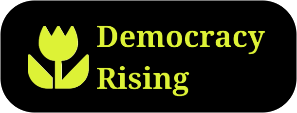

# Welcome to DE-ICE Vancouver!

We're so glad you're here. Today we come together for a block party themed protest at Hootsuite HQ — with marching, interactive art, music, DJs, and community power.

**No to Hootsuite working with ICE!**  
**No to ICE in our city!**  
**No to fascism!**

---

## While You Gather (11:00 – 11:15)

Introduce yourself to someone nearby! Here are a few questions to get the conversation going:

- What brought you out today?
- Have you been to a protest before?
- What protest or solidarity music speaks to you most?

---

## Program — February 21st, 2026

**11:00 AM — Arrive & Gather**  
Find us at Hootsuite HQ. Music is playing, get settled and connect with your community.

**11:15 AM — Opening & Speakers**  
Opening speech, guest speakers, and a musical performance.

**11:30 AM — The March**  
We march around the Hootsuite HQ block and make ourselves seen on Main Street.

**11:45 AM — Block Party Themed Protest**  
Music, art stations, and community activity in full swing. Here are some suggestions to make the most of it:

- ✊ Keep the march going — make yourselves heard!
- 📢 Plant yourself on Main Street and talk to whoever walks by
- 🖼️ Visit our interactive exhibit commemorating victims of ICE violence under Trump
- 🖍️ Let the whole neighbourhood know we were here — chalk anything legal!
- 🎵 Enjoy the music
- 📱 @hootsuite everything you do — let them hear us

**1:15 PM — Regather at Home Base**  
Head back to home base to close out the day together.

**1:20 PM — Closing Ceremony & Remarks**  
We take a moment to reflect on the very real impacts of fascist violence.

**1:30 PM — Après Beers at Brew Hall**  
No reservations have been made, so it's first come first served — get there early!

---

---

## Remember

- We protest peacefully
- This event is still a protest, not an official event — keep your head up out there and stay safe!
